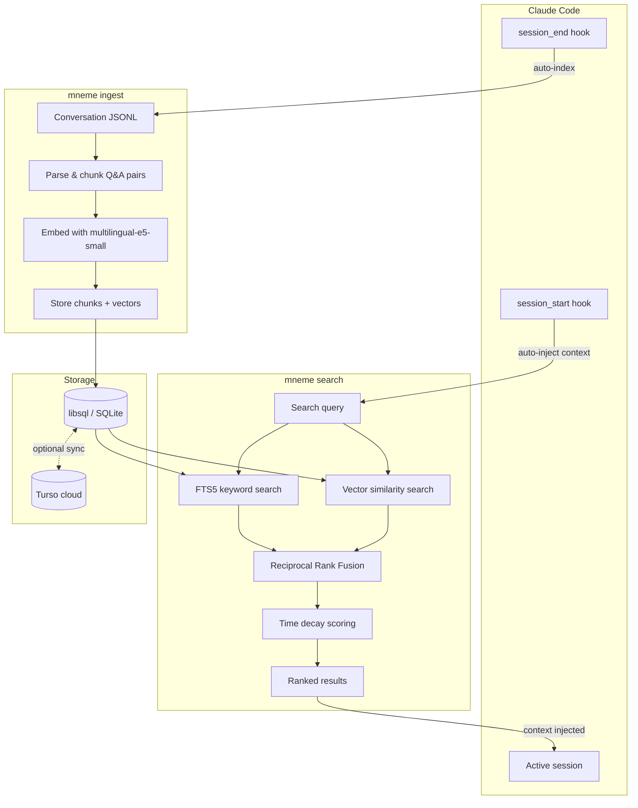

# mneme

<p align="center">
  
</p>

Long-term memory engine for [Claude Code](https://docs.anthropic.com/en/docs/claude-code), powered by [libsql](https://github.com/tursodatabase/libsql).

mneme indexes your Claude Code conversations and makes them searchable across sessions, so context persists instead of starting from scratch every time.

## Features

- **Hybrid search** — FTS5 keyword search + vector similarity, merged via Reciprocal Rank Fusion (RRF)
- **Time decay** — recent memories are prioritized with configurable exponential decay
- **Cross-device sync** — optional [Turso](https://turso.tech) embedded replicas keep memories in sync across machines
- **Claude Code hooks** — automatic ingestion on session end, context injection on session start
- **Offline-first** — works fully offline with local SQLite; sync is opt-in

## Architecture



## Installation

### Prerequisites

- [Rust toolchain](https://rustup.rs/) (1.75+)

### Build & install

```bash
git clone https://github.com/koborinainozomi/mneme.git
cd mneme
cargo install --path .
```

The embedding model ([multilingual-e5-small](https://huggingface.co/intfloat/multilingual-e5-small)) is downloaded automatically on first run via [fastembed](https://github.com/Anush008/fastembed-rs) — no manual setup required. All inference runs locally.

## Usage

### Ingest conversations

```bash
# Ingest a single conversation file
mneme ingest /path/to/conversation.jsonl

# Ingest all conversations in a directory
mneme ingest ~/.claude/projects/my-project/

# Ingest without embeddings (faster, FTS5 only)
mneme ingest --skip-embeddings /path/to/conversations/
```

### Search

```bash
# Hybrid search (FTS5 + vector)
mneme search "how did we set up the database schema"

# FTS5 only (no embedding model required)
mneme search --no-vector "Tailscale configuration"

# Vector only
mneme search --no-fts "authentication design decisions"

# Adjust result count and time decay
mneme search -l 20 --decay-days 60 "error handling patterns"

# JSON output (for programmatic use)
mneme search --json "deployment setup"
```

### Statistics

```bash
mneme stats
mneme stats --json
```

## Claude Code integration

Add these hooks to your Claude Code `settings.json`:

```json
{
  "hooks": {
    "session_end": [
      {
        "command": "mneme ingest ~/.claude/projects/$CLAUDE_PROJECT_ID/"
      }
    ],
    "session_start": [
      {
        "command": "mneme search --json \"$CLAUDE_SESSION_TOPIC\" | head -5"
      }
    ]
  }
}
```

## Cross-device sync with Turso

To sync memories across machines, set up a [Turso](https://turso.tech) database:

```bash
# Create a Turso database
turso db create mneme

# Get the URL and token
turso db show mneme --url
turso db tokens create mneme

# Set environment variables
export MNEME_TURSO_URL="libsql://mneme-<your-org>.turso.io"
export MNEME_TURSO_TOKEN="<your-token>"

# mneme will automatically sync when these are set
mneme search "previous context"
```

Alternatively, pass them as flags:

```bash
mneme --turso-url "libsql://..." --turso-token "..." search "query"
```


## License

MIT
